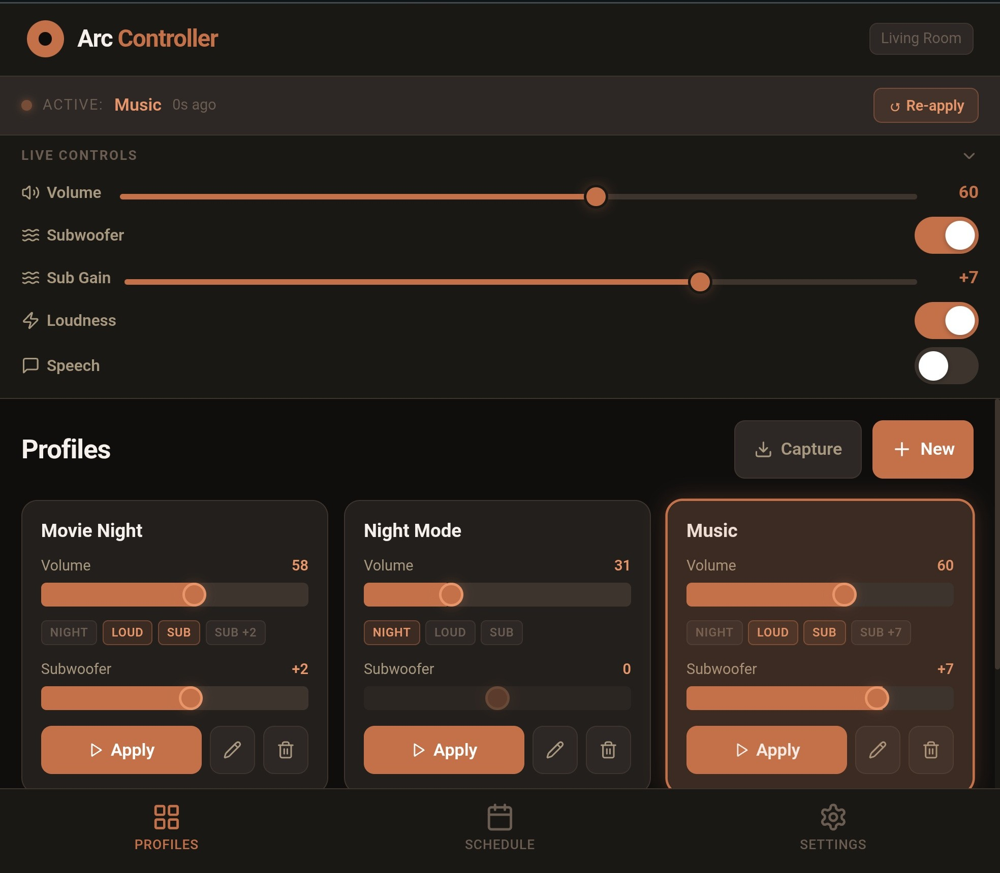

# Sonos Controller

A local web app for controlling Sonos speakers with saved audio profiles, scheduling, and automatic session detection. Built with React + Vite, talks to your Sonos over [node-sonos-http-api](https://github.com/jishi/node-sonos-http-api).



---

## Features

### Now Playing
- See what's currently playing — track title, artist, album, and album art update in real time
- Control playback (play, pause, skip, previous) without opening the Sonos app
- View the full queue so you know what's coming up next
- Album art always shows the correct artwork for the track that's actually playing

### Speaker Grouping
- Combine multiple speakers into one group with a single tap, or split them back apart
- Volume controls automatically adjust to affect the whole group — no more one speaker being louder than another
- The header updates to show which speakers are currently playing together

### Sound Profiles
- Save your favourite sound settings as named profiles — for example "Movie Night", "Music", or "Late Night"
- Each profile remembers volume, bass, treble, night mode, speech enhancement, and subwoofer settings
- Apply any profile in one tap, or snapshot your current Sonos settings directly into a new profile

### Scheduling
- Set profiles to apply automatically at specific times on specific days — useful for a consistent start-of-evening sound level without touching anything
- The activity log keeps a record of every change so you always know what was applied and when

### Live Controls
- Fine-tune volume, bass, treble, and subwoofer in real time using sliders — without touching your saved profiles
- Toggle the subwoofer on or off on the fly

### Always On
- Can run as a background service on macOS so the controller is always available — even when the Mac is asleep or locked
- Settings are saved locally and survive restarts, browser clears, and port changes

---

## Requirements

- macOS or Windows
- A Sonos speaker reachable on your local network
- That's it — Node.js, node-sonos-http-api, and all other dependencies are installed automatically by the install script

---

## Installation

### macOS

Clone the repo, then run the install script:

```bash
git clone https://github.com/tonypest0/sonos-controller.git
cd sonos-controller
bash install.sh
```

The script will:
1. Install Node.js via Homebrew if it isn't already present
2. Run `npm install` — this pulls in all dependencies including [node-sonos-http-api](https://github.com/jishi/node-sonos-http-api)
3. Build the app
4. Ask for your Sonos room name and preferred ports
5. Set up two background services (launchd daemons) that start automatically at boot — even when the Mac is locked

Once complete, open `http://localhost:3000` in your browser.

### Windows

Open PowerShell **as Administrator**, then run:

```powershell
git clone https://github.com/tonypest0/sonos-controller.git
cd sonos-controller
Set-ExecutionPolicy Bypass -Scope Process -Force
.\install.ps1
```

The script will:
1. Install Node.js via winget if it isn't already present
2. Run `npm install` — this pulls in all dependencies including [node-sonos-http-api](https://github.com/jishi/node-sonos-http-api)
3. Build the app
4. Ask for your Sonos room name and preferred ports
5. Register two Windows scheduled tasks under `\Sonos\` that start at boot and restart automatically on failure

Once complete, open `http://localhost:3000` in your browser.

> **Finding your room name:** Open the Sonos app, tap your speaker — the name shown there (case-sensitive) is what to enter during setup.

### Updating

**macOS:**
```bash
git pull
npm run build
sudo launchctl kickstart -k system/com.sonos.controller
```

**Windows** (run as Administrator):
```powershell
git pull
npm run build
Restart-ScheduledTask -TaskPath "\Sonos" -TaskName "SonosController"
```

---

## How CORS is handled

The Sonos API does not send CORS headers, so browsers block direct requests to it. Both the development server (`vite.config.js`) and the production server (`server.js`) include a lightweight proxy that forwards all API calls from the browser through Node.js — no browser CORS issues, no extra configuration needed.

node-sonos-http-api is included as an npm dependency and installed automatically with `npm install`. It runs as a separate process alongside the controller server.

---

## Development

To run a local dev server with hot reload:

```bash
npm install
npm run dev
```

Open `http://localhost:5173`. The Vite dev server includes the same proxy and store middleware as the production server, so everything works identically.

---

## Project structure

```
src/
  components/
    ConnectionConfig.jsx   # Host/port/room settings UI
    NowPlaying.jsx         # Now Playing card with transport controls
    ProfileCard.jsx        # Single profile display + apply button
    ProfileEditor.jsx      # Create / edit profile form
    Queue.jsx              # Current queue panel with thumbnails
    QuickControls.jsx      # Live sliders + speaker group toggle
    Scheduler.jsx          # Schedule list + add form
    ActivityLog.jsx        # Event history log
  hooks/
    useNowPlaying.js       # Polls /zones for playback state + group info
    useProfiles.js         # Profile storage and management
    useSonosApi.js         # All Sonos API calls
    useScheduler.js        # Schedule evaluation and triggering
    useSessionWatcher.js   # Playback state polling for session start
    useActivityLog.js      # Log state management
  lib/
    fileStore.js           # localStorage + server-side file persistence
    sonosArt.js            # Album art URL resolution helper
  App.jsx
  main.jsx
server.js                  # Production server (static files + proxy + store)
install.sh                 # One-command installer for macOS
vite.config.js             # Dev server with proxy + store middleware
```

---

## Bug fixes

| Issue | Fix |
|---|---|
| Volume slider showed wrong value when speakers were grouped | Switched to reading `groupState.volume` from `/zones` instead of individual room volume from `/state` |
| YouTube Music liked-songs showed playlist thumbnail instead of track art | Now fetches art via the Sonos device's `/getaa` endpoint (`albumArtUri`) rather than `absoluteAlbumArtUri` |
| Port conflict when running alongside Claude Code preview server | Daemon now uses `PORT` env var; default bumped to avoid collision |
| Live Controls panel overlapped content when scrolling | Panel is now collapsible and collapses automatically after a profile is applied |
| Volume write applied to individual room only when grouped | Write now uses `groupvolume` command when Kitchen is in the group |

---

## License

[CC BY-NC 4.0](https://creativecommons.org/licenses/by-nc/4.0/) — free for personal and non-commercial use. Commercial use requires explicit written permission.
